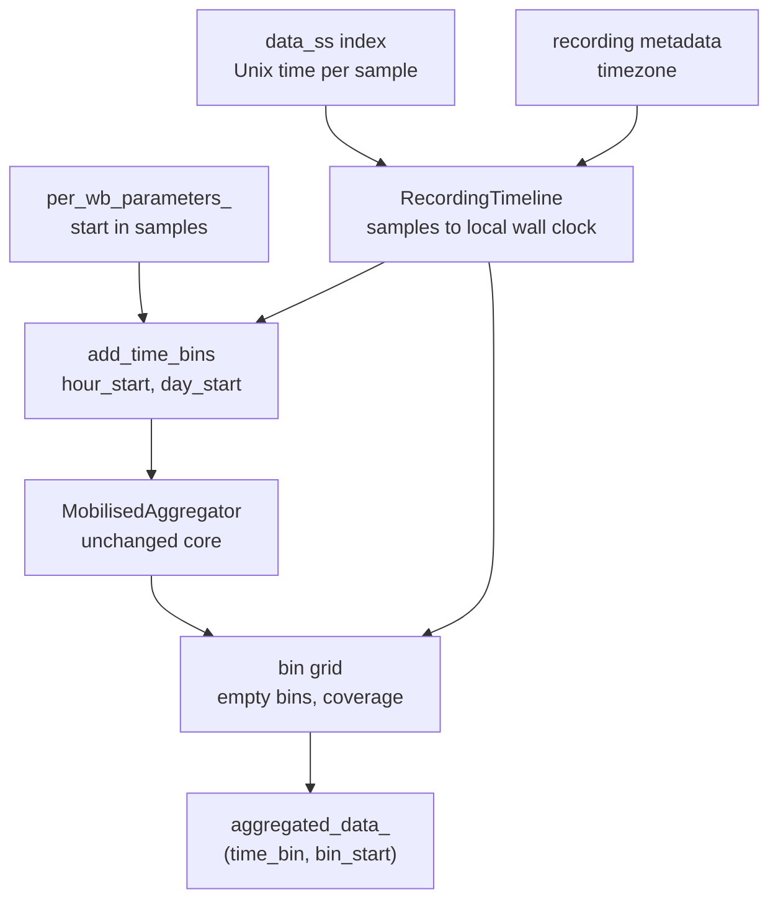
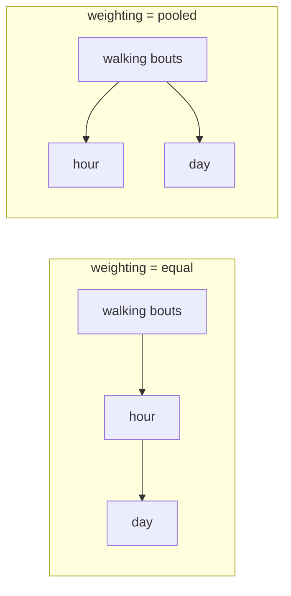

# UoS-MobGap aggregation extensions

Per-hour and per-day DMO aggregation. **Not part of upstream MobGap.**

The upstream `MobilisedAggregator` produces one row per group of the `groupby` columns. For a
free-living recording that is a single row for the whole wear period. This extension adds hour and
day bins on the local wall clock, without changing core MobGap.

## Usage

```python
from mobgap.aggregation.uos import MultiGranularAggregator, RecordingTimeline
from mobgap.data.uos import load_cwa_as_dataset
from mobgap.pipeline import MobilisedPipelineHealthy

dataset = load_cwa_as_dataset(
    "recording.cwa",
    {"height_m": 1.75, "sensor_height_m": 1.0, "cohort": "HA"},
    recording_metadata={"measurement_condition": "free_living"},
    resample_hz=100.0,
    include_time_index=True,
    timezone=None,  # AX3/AX6 clocks are already local. Pass an IANA name if the clock runs in UTC.
)
pipeline = MobilisedPipelineHealthy().safe_run(dataset[0])

timeline = RecordingTimeline.from_datapoint(dataset[0])
result = MultiGranularAggregator(
    time_bins=("hour", "day"),
    weighting="equal",
    min_coverage=0.9,
    day_start_hour=0,
).aggregate(pipeline.per_wb_parameters_, timeline=timeline)

result.aggregated_data_.loc["day"]
```

`aggregated_data_` is one table with a `(time_bin, bin_start)` index. `.loc["day"]` is the daily
table. `.loc["hour"]` is the hourly table.

If you only want the time-bin columns and will aggregate yourself, call `add_time_bins` and pass the
result to the unchanged upstream aggregator:

```python
from mobgap.aggregation import MobilisedAggregator
from mobgap.aggregation.uos import add_time_bins

binned = add_time_bins(pipeline.per_wb_parameters_, timeline)
MobilisedAggregator(groupby=["day_start"]).aggregate(binned).aggregated_data_
```

## What the loader must provide

`RecordingTimeline.from_datapoint` needs a dataset loaded with `include_time_index=True`. Set
`timezone` only when the logger clock runs in UTC. Prefer `from_datapoint` over `from_uniform`.
The data README covers this under "Feeding the per-hour and per-day aggregation".

## Design

### Structure



Three pieces, each usable on its own. A timeline. A binning function. An aggregator that calls the
upstream one. Core MobGap is not modified. The nested aggregator is a parameter, so you can pass a
different `BaseAggregator`.

The subpackage is not in `mobgap.aggregation` or `docs/modules`. Same as `mobgap.data.uos`. Both are
UoS additions on a fork. Putting them in the upstream API listing would make them look official.
Import from `mobgap.aggregation.uos` and read these READMEs.

### The recording must carry real sample times

Walking bouts store sample indices. `start + index / rate` is only correct when the recording has no
gaps. Free-living CWA recordings often have gaps.

omconvert marks a resampled sample invalid when no input data covers it.
`load_cwa_as_dataset(drop_invalid=True)` then removes those samples. After that, sample indices no
longer match elapsed time.

Gaps are not only a startup artefact. A sector whose sequence id does not follow the previous one
starts a new segment. Sessions can sit up to a week apart. Any output time between two segments is
marked invalid. Those three cases live in `omdata.c:497-503`, `omdata.c:1433`, and
`omconvert.c:InterpolatorSeek`. Removing or corrupting a single sector in a synthetic recording
produces a 0.4 s run of invalid samples at the damage.

So `RecordingTimeline.from_datapoint` requires a dataset loaded with `include_time_index=True`. It
raises if the time index is missing, instead of inventing times from `start + index / rate`.

A float Unix-time index is safe for the pipeline. `GsIterator` uses `.iloc`, so `per_wb_parameters_`
is the same with or without the time index. Cost is 8 bytes per sample, about 0.5 GB for a week at
100 Hz.

`RecordingTimeline.from_uniform` is for synthetic or non-CWA data that is known to have no gaps.

### Time is local wall clock, with no timezone attached

Unix timestamps carry no timezone. The sample clock alone cannot say when midnight was.
`load_cwa_as_dataset(timezone=...)` writes one `timezone` argument into the recording metadata. The
timeline reads it back.

- `None` (default). The recording clock already runs in local time. OpenMovement AX3/AX6 loggers are
set to the local time of the study site and never store an offset. This is the usual case.
- An IANA name such as `"Europe/London"`. The recording clock runs in UTC and is converted, daylight
saving included.

After that conversion, every timestamp is local wall clock with no timezone attached. A day is then
always 24 hours. Hour boundaries stay on the hour, even in zones with a half-hour offset. Bin
arithmetic stays simple.

Daylight saving costs two odd days in a converted recording. In spring, one hour bin never happened
and stays empty. In autumn, one hour bin holds two hours of data, with coverage reported as 1, not
2. Both are visible. Neither changes a neighbouring bin.

The local clock with no timezone runs backwards for an hour at the autumn change. A recording that
ends in the repeated hour can have a last sample whose local label is earlier than samples recorded
before it. Comparing those labels cannot decide which bins hold data. `time_bin_grid` and
`bin_coverage` compare Unix seconds instead, where the order is never in doubt.

### Where a day starts

`day_start_hour` moves the day boundary off midnight. A bout at 01:00 can then count towards the
previous day. The day is still 24 hours. Only when it starts changes. The timestamps are shifted,
rounded down to the day, then shifted back.

Whole hours only. A half-hour offset would put some hour bins across two days. Equal weighting
builds a day from its hours, so an hour that belonged to two days would have no correct home. Whole
hours mean every day contains exactly 24 hour bins.

### Weighting

Pooling every walking bout of a day into one aggregation weights each hour by how much walking it
holds. A single busy hour can then decide the daily average cadence. That is why there is a
`weighting` argument.



`"equal"` is the default. A daily average should describe the day, not the busiest hour in it.
`"pooled"` matches the upstream and original Mobilise-D behaviour. Keep it when you need to compare
with published Mobilise-D results.

Two properties the tests check:

- **Counts and totals are identical under both weightings.** Walking bouts are assigned by their
start. Summing the hourly counts of a day gives the same number as counting the day directly. Only
averages, percentiles, and coefficients of variation change.
- **Empty bins do not pull averages towards zero.** An hour without walking has no cadence to
contribute, so it is left out of the daily average. It still contributes a zero to the counts and
totals.

There is a limit, documented on the class. Under `"equal"`, the daily statistic is the average of
the hourly ones. The average of the hourly 90th percentiles is not the daily 90th percentile. The
average of the hourly coefficients of variation measures variability inside each hour. If you need
the pooled definition of those statistics, pass `"pooled"`. To see how many hours a daily average is
computed from, request the hourly bin in the same call. That adds no extra pipeline work.

### Complete grid and coverage

Every bin the recording reaches into is reported, including bins with no walking. A per-hour profile
that hides empty hours is misleading. It also cannot be plotted or averaged correctly. Counts and
totals of such a bin are zero. Averages are `NaN`.

Each bin also has a `coverage` column. That is the fraction of the bin for which the recording
actually holds samples. With measured sample times this is one `np.searchsorted` of the bin edges
into the sorted times. That counts samples per bin, so it sees gaps anywhere in the recording, not
only truncation at the ends. A uniform timeline has no record of lost samples. There, only the ends
of the recording reduce coverage.

`min_coverage` drops bins below a threshold. It is a fraction, not a "keep only whole bins" flag.
Exact coverage would make that flag far too strict. One lost sector, 0.4 s, would discard an entire
day. A fraction also matches how wear-time validity is usually written in this field.

Coverage judges **reporting**, not data. Dropping an hour does not remove its walking bouts from its
day. That is what keeps the totals identical under both weightings, and what stops the threshold
from dropping walking bouts without saying so.

The grid is also the only thing that decides which walking bouts survive, because the aggregated
bins are reindexed onto it. A bout whose bin is not on the grid would disappear, taking its counts
and totals with it. `MultiGranularAggregator` raises instead.

The usual mistake is `RecordingTimeline.from_uniform`. It trusts the `n_samples` it is given.
`timestamps()` then computes times past the last sample. A timeline built for a different or trimmed
recording pushes bouts off the end. Prefer `from_datapoint`, which reads the sample times from the
data itself.

### Performance

`"equal"` runs the upstream aggregation once, on the hourly bins, and derives the days with one
grouped pass. `"pooled"` cannot share work between levels and runs the upstream aggregation once per
requested bin. Both operate on the walking bout table, which holds hundreds to a few thousand rows
for a week of free-living data. The pipeline that produced those rows dominates the cost.

Placing bouts on the clock is one indexed lookup per bout. Coverage is a handful of binary searches.
Neither grows with the length of the recording.
