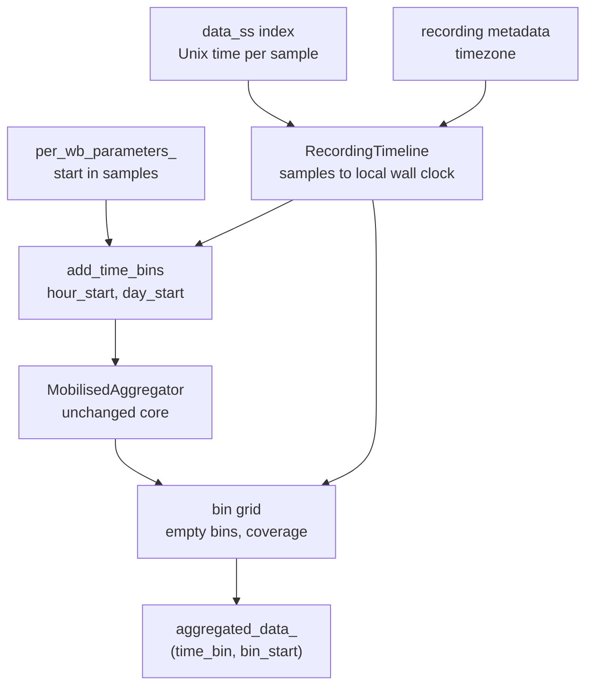
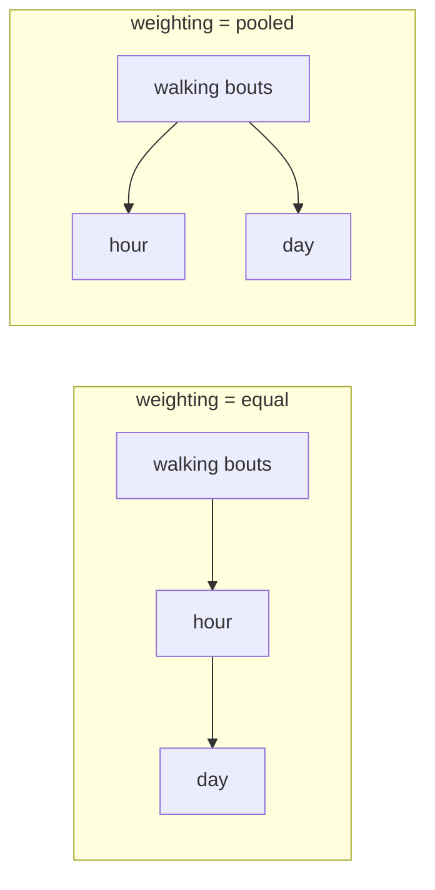

# UoS-MobGap aggregation extensions

Per-hour and per-day DMO aggregation. **Not part of upstream MobGap.**

The upstream `MobilisedAggregator` produces one row per group of the `groupby` columns, which for a
free-living recording means a single row for the whole wear period. This extension adds the missing
wall-clock dimension without changing anything in core MobGap.

## Usage

```python
from mobgap.aggregation.uos import MultiGranularAggregator, RecordingTimeline
from mobgap.data.uos import load_cwa_as_dataset
from mobgap.pipeline import MobilisedPipelineHealthy

dataset = load_cwa_as_dataset(
    "recording.cwa",
    {"height_m": 1.75, "sensor_height_m": 1.0, "cohort": "HA"},
    recording_metadata={"measurement_condition": "free_living"},
    resample_hz=100.0,
    include_time_index=True,
    timezone=None,  # the AX3/AX6 clock is already local; set an IANA name if it runs in UTC
)
pipeline = MobilisedPipelineHealthy().safe_run(dataset[0])

timeline = RecordingTimeline.from_datapoint(dataset[0])
result = MultiGranularAggregator(
    time_bins=("hour", "day"),
    weighting="equal",
    min_coverage=0.9,
    day_start_hour=0,
).aggregate(pipeline.per_wb_parameters_, timeline=timeline)

result.aggregated_data_.loc["day"]
```

`aggregated_data_` is a single table indexed by `(time_bin, bin_start)`, so `.loc["day"]` gives the
daily table and `.loc["hour"]` the hourly one.

If you only want the time bins as extra columns and prefer to aggregate yourself, use the binning on
its own. This is the plug-and-play route into the unchanged upstream aggregator:

```python
from mobgap.aggregation import MobilisedAggregator
from mobgap.aggregation.uos import add_time_bins

binned = add_time_bins(pipeline.per_wb_parameters_, timeline)
MobilisedAggregator(groupby=["day_start"]).aggregate(binned).aggregated_data_
```


## Design


### Structure




Three separate pieces, each usable on its own: a timeline, a binning function, and an aggregator that
drives the upstream one. Nothing in core MobGap is touched, and the nested aggregator is a parameter,
so a different `BaseAggregator` can be dropped in.

The subpackage stays out of the `mobgap.aggregation` namespace and out of `docs/modules`, the same
way `mobgap.data.uos` does. Both are UoS additions on a fork, and merging them into the upstream API
listing would make them look like part of it. Import them from `mobgap.aggregation.uos` and read
these READMEs, not the rendered API docs.

### The recording must carry real sample times

Walking bouts carry sample indices. Turning a sample index into a wall-clock time by
`start + index / rate` is only correct for a gapless recording, and free-living CWA recordings are
not reliably gapless. omconvert marks an output sample invalid whenever no input data covers it, and
`load_cwa_as_dataset(drop_invalid=True)` then removes those samples, after which sample indices no
longer track elapsed time.

Those gaps are not only a startup artefact. A sector whose sequence id does not follow the previous
one starts a new segment (`omdata.c:497-503`), sessions tolerate up to a week between segments
(`omdata.c:1433`), and any output time falling between two segments is marked invalid
(`omconvert.c:InterpolatorSeek`). Removing or corrupting a single sector in the middle of a synthetic
recording reproduces this exactly: a 0.4 s run of invalid samples at the point of the damage.

So `RecordingTimeline.from_datapoint` **requires** a dataset loaded with `include_time_index=True`
and refuses anything else, rather than silently drifting. A float epoch index is safe to feed through
the pipeline: `GsIterator` slices positionally with `.iloc`, and `per_wb_parameters_` comes out
bit-identical with and without it, which
`test_a_float_time_index_does_not_change_what_the_pipeline_computes` checks against the lab example
data. It costs 8 bytes per sample, about 0.5 GB for a week at 100 Hz.

`RecordingTimeline.from_uniform` remains for synthetic or non-CWA data that is known to be gapless.

### Time is local wall clock, and naive

Unix timestamps carry no timezone, so the sample clock alone cannot say when midnight was. The
timeline resolves this with a single `timezone` knob, written by
`load_cwa_as_dataset(timezone=...)` and read back from the recording metadata:

- `None` (default): the recording clock already runs in local time. OpenMovement AX3/AX6 loggers are
configured with the local time of the study site and never store an offset, so this is the common
case and needs nothing from the user.
- An IANA name such as `"Europe/London"`: the recording clock runs in UTC and is converted, daylight
saving included.

Everything downstream of that conversion works on timezone-naive local timestamps. This is what keeps
a day exactly 24 hours long, keeps hour boundaries on the hour in zones with half-hour offsets, and
keeps the bin arithmetic trivial. The cost is that the two daylight saving days of the year look
slightly odd in a converted recording: the spring day holds an hour bin that never happened and is
therefore empty, and the autumn day holds an hour bin with two hours of data in it, reported at a
coverage of 1 rather than 2. Both are visible and neither corrupts a neighbouring bin.

Keeping that promise takes some care, because the naive local clock runs backwards for an hour at
the autumn transition. A recording whose last sample falls in the repeated hour ends at a *lower*
local timestamp than samples it recorded earlier, so deciding which bins hold data cannot be done by
comparing local labels. `time_bin_grid` and `bin_coverage` both make that decision in epoch seconds
instead, where the order is never in doubt.

### Where a day starts

`day_start_hour` moves the day boundary off midnight, so a bout at 01:00 can count towards the
previous day. The day stays 24 hours long, only its phase changes: floor with the offset subtracted,
then add it back.

Whole hours only. A half-hour offset would leave hour bins straddling day boundaries, and equal
weighting builds a day out of its hours, so an hour belonging to two days would have no correct
home. Restricting the offset to whole hours makes 24 hour bins nest exactly inside every day by
construction.

### Weighting

The reason a knob is needed at all: pooling all walking bouts of a day into one aggregation weights
each hour by how much walking it holds, so a single busy hour can decide the daily average cadence.




`"equal"` is the default because a daily average should describe the day, not the busiest hour in it.
`"pooled"` reproduces the upstream and original Mobilise-D behaviour and stays available for
comparison with published Mobilise-D results.

Two properties keep the knob honest:

- **Counts and totals are identical under both weightings.** Walking bouts are partitioned by their
start, so summing the hourly counts of a day gives the same number as counting the day directly. The
knob only ever moves averages, percentiles, and coefficients of variation. This is asserted in the
test suite.
- **Empty bins do not drag averages down.** An hour without walking has no cadence to contribute, so
it is left out of the daily average. It does contribute a zero to the counts and totals.

The honest limitation, documented on the class: under `"equal"` the daily statistic is the average of
the hourly ones. The average of the hourly 90th percentiles is not the daily 90th percentile, and the
average of the hourly coefficients of variation measures within-hour variability. Users who need the
pooled definition of those statistics should ask for `"pooled"`. To judge how many hours a daily
average rests on, request the hourly bin in the same call, which costs nothing extra.

### Complete grid and coverage

Every bin the recording reaches into is reported, including bins with no walking, because a per-hour
profile with hours silently missing is misleading and cannot be plotted or averaged correctly. Counts
and totals of such a bin are zero and its averages are `NaN`.

Each bin also carries a `coverage` column: the fraction of the bin for which the recording actually
holds samples. With measured sample times this is one `np.searchsorted` of the bin edges into the
sorted times, which counts samples per bin and therefore sees gaps anywhere in the recording, not
only truncation at the ends. A uniform timeline has no record of lost samples, so there only the ends
of the recording reduce coverage.

`min_coverage` drops bins below a threshold. It is a fraction rather than a "keep only whole bins"
flag because exact coverage makes such a flag far too strict: one lost sector, 0.4 s, would discard
an entire day. A fraction also matches how wear-time validity is normally expressed in this field.

Coverage judges **reporting**, not data. Dropping an hour does not remove its walking bouts from its
day, which is what keeps the totals identical under both weightings and stops the threshold from
quietly censoring data.

The grid is also the only thing that decides which walking bouts survive, since the aggregated bins
are reindexed onto it. A bout whose bin is not on the grid would disappear silently, taking its
counts and totals with it, so `MultiGranularAggregator` raises instead. In practice that means one
mistake: `RecordingTimeline.from_uniform` believes the `n_samples` it is given, and `timestamps()`
happily extrapolates past it, so a timeline built for a different or trimmed recording pushes bouts
off the end. Prefer `from_datapoint`, which reads the sample times from the data itself.

### Performance

`"equal"` runs the upstream aggregation once, on the hourly bins, and derives the days with one
grouped pass. `"pooled"` cannot share work between levels and runs the upstream aggregation once per
requested bin. Both operate on the walking bout table, which holds hundreds to a few thousand rows
for a week of free-living data, so the cost is dominated by the pipeline that produced it.

Placing bouts on the clock is a single indexed lookup per bout, and coverage is a handful of binary
searches, so neither scales with the length of the recording.